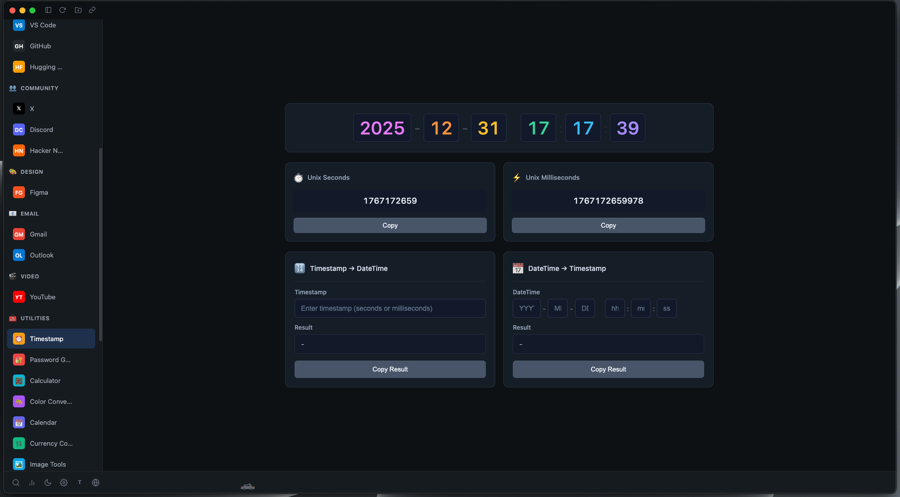
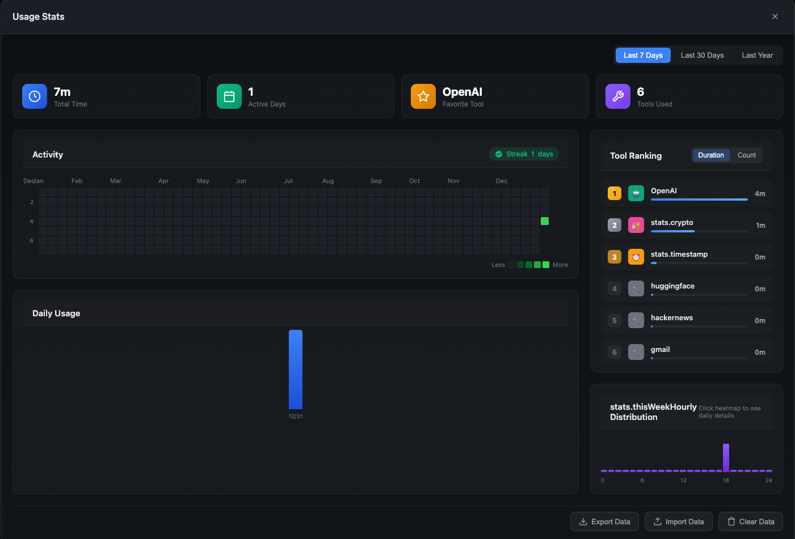

# ToolHub - 开发者全能工具箱

<p align="center">
  <a href="README.md">English</a> | <a href="README_CN.md">简体中文</a>
</p>

<p align="center">
  
</p>

> 一款强大的 Electron 桌面应用，将 AI 聊天平台和 20+ 开发者必备工具整合在一个统一的工作空间中。


## 截图展示

<p align="center">
  
</p>

<p align="center">
  
</p>

<p align="center">
  
</p>

<p align="center">
  
</p>

## 为什么选择 ToolHub？

**告别在数十个浏览器标签页和应用之间来回切换的烦恼。** ToolHub 将开发者所需的一切整合到一个精美的桌面应用中：

- 🤖 **7 大 AI 助手** - ChatGPT、Gemini、DeepSeek、Kimi、Grok、Perplexity、LMArena
- 🛠️ **20+ 内置工具** - JSON 格式化、Base64 编解码、JWT 解析等
- 💾 **数据库客户端** - MySQL、PostgreSQL、SQLite、Redis、MongoDB
- 🎨 **现代暗色 UI** - 霓虹风格设计，护眼舒适

## 功能特性

### AI 聊天平台

| 平台 | 描述 |
|------|------|
| [ChatGPT](https://chat.openai.com) | OpenAI 强大的对话式 AI |
| [Gemini](https://gemini.google.com) | Google 多模态 AI 助手 |
| [DeepSeek](https://chat.deepseek.com) | 专业代码生成 AI |
| [Kimi](https://kimi.moonshot.cn) | 长文本处理专家 |
| [Grok](https://grok.x.ai) | xAI 实时信息 AI |
| [Perplexity](https://www.perplexity.ai/) | AI 驱动的搜索引擎 |
| [LMArena](https://lmarena.ai/zh) | LLM 排行榜与对比 |

### 开发者工具

| 分类 | 工具 |
|------|------|
| **编码转换** | Base64、URL、Unicode、JWT |
| **加密解密** | MD5、SHA、AES、DES 加密 |
| **数据处理** | JSON 格式化、Diff 对比、正则测试 |
| **网络工具** | cURL 构建器、DNS 查询 |
| **实用工具** | 时间戳转换、密码生成器、计算器 |
| **媒体工具** | 取色器、图片压缩 |
| **数据库** | MySQL、PostgreSQL、SQLite、Redis、MongoDB 客户端 |

### 用户体验

- **自定义网站** - 添加任意网站到应用，支持自定义图标和分类
- **会话持久化** - 聊天记录和工具数据自动保存
- **快捷键支持** - 使用热键快速导航
- **响应式布局** - 适配任意窗口大小
- **跨平台支持** - 支持 macOS、Windows 和 Linux

## 下载

下载最新版本的 ToolHub macOS 版。目前仅支持 macOS，Windows 和 Linux 版本即将推出。

> **macOS 用户提示**：如果遇到"已损坏"或"无法打开"的错误，请在终端中运行：
> ```bash
> xattr -cr /Applications/ToolHub.app
> ```

## 技术栈

- **框架**: Electron 28
- **语言**: TypeScript 5.4
- **数据库**: better-sqlite3、mysql2、pg、mongodb、ioredis
- **构建**: electron-builder

## 开发计划

- [ ] 插件系统，支持自定义工具
- [ ] 云端同步设置

**用 ❤️ 为注重效率的开发者打造**

## Star 趋势

[](https://www.star-history.com/#idonkeyliu/ToolHub&type=date&legend=top-left)

⭐ **如果 ToolHub 对你有帮助，请给个 Star！**
